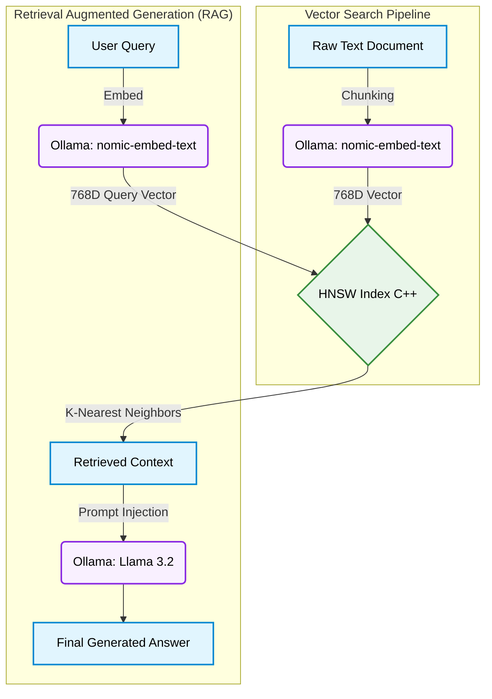

<div align="center">

# 🧠 Your-Own-AI (VectorDB) — Build a Vector Database from Scratch in C++

**A fully working vector database with HNSW, KD-Tree, and Brute Force search, plus a local RAG pipeline powered by Ollama**

[](https://isocpp.org/)
[](https://ollama.com/)
[](https://arxiv.org/abs/1603.09320)
[](#rest-api-reference)

</div>

---

## 📖 Overview

A fully working **Vector Database** built from scratch in C++ with a web UI. Implements **HNSW**, **KD-Tree**, and **Brute Force** search algorithms side-by-side, plus a **RAG pipeline** powered by a local LLM via Ollama.

---

## ✨ What This Project Does

| Feature | Description |
|---|---|
| 🔎 **3 Search Algorithms** | HNSW (production-grade), KD-Tree, Brute Force — run all three and compare speed |
| 📐 **3 Distance Metrics** | Cosine similarity, Euclidean distance, Manhattan distance |
| 🎯 **16D Demo Vectors** | 20 pre-loaded semantic vectors across 4 categories (CS, Math, Food, Sports) |
| 📊 **2D PCA Scatter Plot** | Live visualization of semantic space — watch clusters form |
| 📄 **Real Document Embedding** | Paste any text → Ollama embeds it with `nomic-embed-text` (768D) |
| 🤖 **RAG Pipeline** | Ask questions about your documents → HNSW retrieves context → local LLM answers |
| 🔌 **Full REST API** | CRUD endpoints: insert, delete, search, benchmark, hnsw-info |

---

## 🧠 How It Works



**HNSW (Hierarchical Navigable Small World)** is the same algorithm used by Pinecone, Weaviate, Chroma, and Milvus. It builds a multilayer graph where each layer is progressively sparser — searches start at the top layer and zoom in, achieving O(log N) complexity instead of O(N) for brute force.

---

## ⚙️ Prerequisites

You need **3 things** installed on your Windows laptop:

1. **MSYS2** (gives you the g++ compiler)
2. **Git**
3. **Ollama** (runs the local AI models)

---

## 🚀 Step-by-Step Setup (Windows)

### Step 1 — Install MSYS2 (C++ Compiler)

1. Go to [msys2.org](https://www.msys2.org) and download the installer
2. Run the installer, keep the default path (`C:\msys64`)
3. After install, open **MSYS2 UCRT64** from the Start Menu (the orange icon)
4. Run these commands inside the MSYS2 terminal:

```bash
pacman -Syu
```

*(Close and reopen the terminal if it asks you to)*

```bash
pacman -S mingw-w64-ucrt-x86_64-gcc
```

5. Add g++ to your Windows PATH:
   - Press `Win + R`, type `sysdm.cpl`, press Enter
   - Click **Advanced** → **Environment Variables**
   - Under **System variables**, find **Path**, click **Edit**
   - Click **New** and add: `C:\msys64\ucrt64\bin`
   - Click OK on all windows
   - **Open a new PowerShell** and verify:

```bash
g++ --version
```

You should see something like `g++ (GCC) 15.x.x`

### Step 2 — Install Git

1. Go to [git-scm.com/download/win](https://git-scm.com/download/win) and download Git for Windows
2. Run the installer with default settings
3. Verify in PowerShell:

```bash
git --version
```

### Step 3 — Install Ollama (Local AI Models)

1. Go to [ollama.com](https://ollama.com) and click **Download for Windows**
2. Run the installer — Ollama starts automatically in the system tray
3. Open PowerShell and pull the two required models:

```bash
ollama pull nomic-embed-text   # ~274 MB — the embedding model
ollama pull llama3.2:1b        # ~1.3 GB — the language model
```

4. Verify Ollama is running:

```bash
ollama list
```

> **Minimum specs for Ollama:** 8GB RAM recommended. The models will use ~3GB total.

### Step 4 — Clone the Repository

```bash
git clone https://github.com/Shashank17singh/Your-Own-AI.git
cd Your-Own-AI
```

### Step 5 — Compile the C++ Server

```bash
g++ -std=c++17 -O2 main.cpp -o db -lws2_32
```

This produces `db.exe` in about 10–20 seconds.

> **Troubleshooting:**
> - `g++: command not found` → MSYS2 not in PATH, redo Step 1 point 5
> - `undefined reference to WSA...` → missing `-lws2_32` flag, add it
> - Takes too long? Remove `-O2` for a faster (but slower) compile

### Step 6 — Run Everything

**Terminal 1** — Start Ollama (if not already running):

```bash
ollama serve
```

*(If Ollama is already in the system tray, skip this)*

**Terminal 2** — Start the VectorDB server:

```bash
./db
```

You should see:

```
=== VectorDB Engine ===
http://localhost:8080
20 demo vectors | 16 dims | HNSW+KD-Tree+BruteForce
Ollama: ONLINE
  embed model: nomic-embed-text  gen model: llama3.2
```

Open your browser to **http://localhost:8080**.

---

## 🖱️ Using the Application

### Tab 1: Search (Demo Vectors)

- Type any concept in the search box: `binary tree`, `sushi`, `basketball`, `calculus`
- Choose your algorithm: **HNSW**, **KD-Tree**, or **Brute Force**
- Choose distance metric: **Cosine**, **Euclidean**, or **Manhattan**
- Click **⚡ SEARCH** — results appear with distances, the matching point glows on the scatter plot
- Click **▶ COMPARE ALL ALGOS** to run all 3 algorithms and compare their speed

The scatter plot shows all 20 vectors projected to 2D using PCA. The 4 semantic categories (CS, Math, Food, Sports) form distinct clusters — that's what "semantic similarity" looks like visually.

### Tab 2: Documents (Real Embeddings)

Uses Ollama to generate **real 768-dimensional embeddings** from any text.

1. Type a title (e.g., `Operating Systems Notes`)
2. Paste any text — lecture notes, textbook paragraphs, Wikipedia articles
3. Click **⚡ EMBED & INSERT**
4. Long documents are automatically split into overlapping 250-word chunks
5. Each chunk gets its own embedding and is stored in a separate HNSW index

### Tab 3: Ask AI (RAG Pipeline)

1. Make sure you've inserted some documents in Tab 2 first
2. Type a question about your documents
3. Click **🤖 ASK AI**

What happens behind the scenes:

```
1. Your question → embedded with nomic-embed-text (768D vector)
2. HNSW search → finds 3 most semantically similar chunks
3. Retrieved chunks → sent as context to llama3.2:1b
4. llama3.2:1b → generates an answer based only on your documents
```

The answer streams in with a typewriter effect. Click the **context chips** to see exactly which chunks the AI used.

---

## 📡 REST API Reference

The server exposes a full REST API at `http://localhost:8080`.

### Demo Vector Endpoints

| Method | Endpoint | Description |
|---|---|---|
| `GET` | `/search?v=f1,f2,...&k=5&metric=cosine&algo=hnsw` | K-NN search |
| `POST` | `/insert` | Insert a demo vector |
| `DELETE` | `/delete/:id` | Delete by ID |
| `GET` | `/items` | List all demo vectors |
| `GET` | `/benchmark?v=...&k=5&metric=cosine` | Compare all 3 algorithms |
| `GET` | `/hnsw-info` | HNSW graph structure and layer stats |
| `GET` | `/stats` | Database statistics |

### Document & RAG Endpoints

| Method | Endpoint | Body | Description |
|---|---|---|---|
| `POST` | `/doc/insert` | `{"title":"...","text":"..."}` | Embed and store document |
| `GET` | `/doc/list` | — | List all stored documents |
| `DELETE` | `/doc/delete/:id` | — | Delete document chunk |
| `POST` | `/doc/ask` | `{"question":"...","k":3}` | RAG: retrieve + generate |
| `GET` | `/status` | — | Ollama status and model info |

### Example: Search via curl

```bash
curl "http://localhost:8080/search?v=0.9,0.8,0.7,0.6,0.1,0.1,0.1,0.1,0.1,0.1,0.1,0.1,0.1,0.1,0.1,0.1&k=3&metric=cosine&algo=hnsw"
```

### Example: Ask a question via curl

```bash
curl -X POST http://localhost:8080/doc/ask `
  -H "Content-Type: application/json" `
  -d '{"question":"What is dynamic programming?","k":3}'
```

---

## 📂 Project Structure

```
VectorDB/
├── main.cpp        ← C++ backend (HNSW, KD-Tree, BruteForce, REST API, RAG)
├── httplib.h       ← Single-header HTTP server library (cpp-httplib)
├── index.html      ← Frontend (PCA scatter plot, chat UI, benchmark)
└── README.md       ← This file
```

### Architecture (main.cpp)

```
BruteForce          O(N·d)      Exact, baseline
KDTree              O(log N)    Exact, axis-aligned partitioning
HNSW                O(log N)    Approximate, multilayer small-world graph

VectorDB            Unified interface over all 3 (16D demo vectors)
DocumentDB          HNSW-only index for real Ollama embeddings (768D)
OllamaClient        HTTP client → /api/embeddings + /api/generate
```

---

## 🔬 Algorithm Deep Dive

### HNSW (Hierarchical Navigable Small World)

Nodes are inserted into a multilayer graph. Each node randomly gets assigned a maximum layer. Layer 0 has all nodes with many connections; higher layers have exponentially fewer nodes with longer-range connections.

**Insert:** Start at the top layer, greedily find the nearest node, drop a layer, repeat. At each layer from your assigned max down to 0, run a beam search (`ef_construction=200`) and connect to the M nearest neighbors bidirectionally.

**Search:** Same greedy descent from the top layer. At layer 0, expand to `ef` nearest candidates using a priority queue.

**Why it's fast:** The upper layers act like a highway — you quickly get to the right neighborhood, then zoom in at layer 0.

### KD-Tree (K-Dimensional Tree)

Binary space partitioning. Each node splits space along one dimension (cycling through all dimensions). Search prunes entire subtrees when the closest possible point in that subtree can't beat the current best — the "ball within hyperslab" check.

**Weakness:** Degrades with high dimensions (curse of dimensionality). Works well for ≤20D, becomes close to brute force at 768D.

### Why HNSW Wins at High Dimensions

KD-Tree pruning relies on axis-aligned distance bounds. In high dimensions, almost all the space is near the boundary of the hypersphere — no subtrees get pruned. HNSW's graph-based approach doesn't have this problem.

---

## 🛠️ Common Issues

| Problem | Fix |
|---|---|
| `Ollama: OFFLINE` in header | Run `ollama serve` in a terminal |
| Embedding takes forever | Ollama is downloading the model on first use, wait ~2 min |
| `g++: command not found` | Add `C:\msys64\ucrt64\bin` to Windows PATH |
| Port 8080 already in use | Kill the process: `netstat -ano \| findstr 8080` then `taskkill /PID <pid> /F` |
| LLM answer is slow | Normal — llama3.2:1b takes 10–30s on a laptop CPU. |


---
